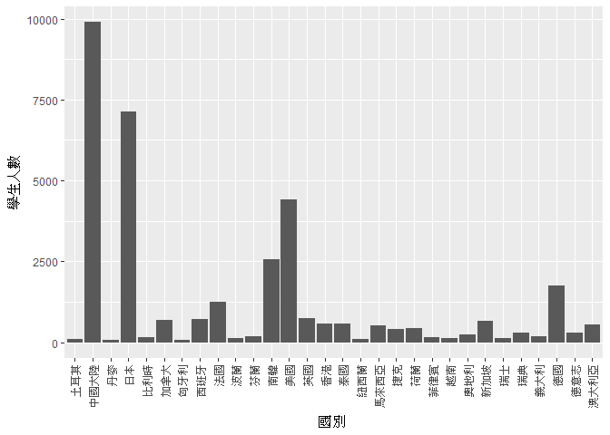
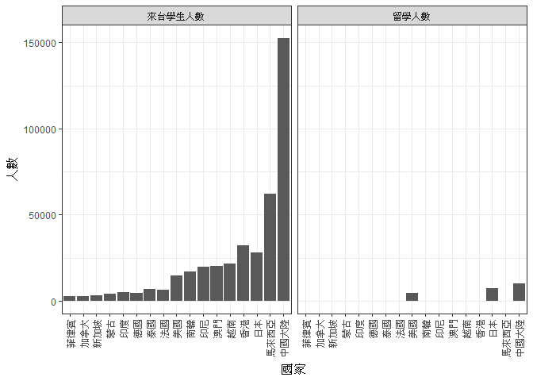

106-2 大數據分析方法 作業二
================
Yi-Ju Tseng

作業完整說明[連結](https://docs.google.com/document/d/1aLGSsGXhgOVgwzSg9JdaNz2qGPQJSoupDAQownkGf_I/edit?usp=sharing)

學習再也不限定在自己出生的國家，台灣每年有許多學生選擇就讀國外的大專院校，同時也有人多國外的學生來台灣就讀，透過分析[大專校院境外學生人數統計](https://data.gov.tw/dataset/6289)、[大專校院本國學生出國進修交流數](https://data.gov.tw/dataset/24730)、[世界各主要國家之我國留學生人數統計表](https://ws.moe.edu.tw/Download.ashx?u=C099358C81D4876CC7586B178A6BD6D5062C39FB76BDE7EC7685C1A3C0846BCDD2B4F4C2FE907C3E7E96F97D24487065577A728C59D4D9A4ECDFF432EA5A114C8B01E4AFECC637696DE4DAECA03BB417&n=4E402A02CE6F0B6C1B3C7E89FDA1FAD0B5DDFA6F3DA74E2DA06AE927F09433CFBC07A1910C169A1845D8EB78BD7D60D7414F74617F2A6B71DC86D17C9DA3781394EF5794EEA7363C&icon=..csv)可以了解103年以後各大專院校國際交流的情形。請同學分析以下議題，並以視覺化的方式呈現分析結果，呈現103年以後大專院校國際交流的情形。

來台境外生分析
--------------

### 資料匯入與處理

``` r
library(readr)
```

    ## Warning: package 'readr' was built under R version 3.4.4

``` r
library(dplyr)
```

    ## 
    ## Attaching package: 'dplyr'

    ## The following objects are masked from 'package:stats':
    ## 
    ##     filter, lag

    ## The following objects are masked from 'package:base':
    ## 
    ##     intersect, setdiff, setequal, union

``` r
library(ggmap)
```

    ## Warning: package 'ggmap' was built under R version 3.4.4

    ## Loading required package: ggplot2

    ## Warning: package 'ggplot2' was built under R version 3.4.4

``` r
library(ggplot2)
library(choroplethrMaps)
```

    ## Warning: package 'choroplethrMaps' was built under R version 3.4.4

``` r
library(choroplethr)
```

    ## Warning: package 'choroplethr' was built under R version 3.4.4

    ## Loading required package: acs

    ## Warning: package 'acs' was built under R version 3.4.4

    ## Loading required package: stringr

    ## Warning: package 'stringr' was built under R version 3.4.4

    ## Loading required package: XML

    ## Warning: package 'XML' was built under R version 3.4.4

    ## 
    ## Attaching package: 'acs'

    ## The following object is masked from 'package:dplyr':
    ## 
    ##     combine

    ## The following object is masked from 'package:base':
    ## 
    ##     apply

``` r
library(knitr)
```

    ## Warning: package 'knitr' was built under R version 3.4.4

``` r
library(tidyr)
```

    ## Warning: package 'tidyr' was built under R version 3.4.4

``` r
#整理各國學生來台念書的資料表
school103 <- read_csv("http://stats.moe.gov.tw/files/detail/103/103_ab103_C.csv")
```

    ## Parsed with column specification:
    ## cols(
    ##   洲別 = col_character(),
    ##   國別 = col_character(),
    ##   `學位生-正式修讀學位外國生` = col_integer(),
    ##   `學位生-僑生(含港澳)` = col_integer(),
    ##   `學位生-正式修讀學位陸生` = col_integer(),
    ##   `非學位生-外國交換生` = col_integer(),
    ##   `非學位生-外國短期研習及個人選讀` = col_integer(),
    ##   `非學位生-大專附設華語文中心學生` = col_integer(),
    ##   `非學位生-大陸研修生` = col_integer(),
    ##   `非學位生-海青班` = col_integer(),
    ##   境外專班 = col_integer()
    ## )

``` r
school104 <- read_csv("http://stats.moe.gov.tw/files/detail/104/104_ab104_C.csv")
```

    ## Parsed with column specification:
    ## cols(
    ##   洲別 = col_character(),
    ##   國別 = col_character(),
    ##   `學位生-正式修讀學位外國生` = col_integer(),
    ##   `學位生-僑生(含港澳)` = col_integer(),
    ##   `學位生-正式修讀學位陸生` = col_integer(),
    ##   `非學位生-外國交換生` = col_integer(),
    ##   `非學位生-外國短期研習及個人選讀` = col_integer(),
    ##   `非學位生-大專附設華語文中心學生` = col_integer(),
    ##   `非學位生-大陸研修生` = col_integer(),
    ##   `非學位生-海青班` = col_integer(),
    ##   境外專班 = col_integer()
    ## )

``` r
school105 <- read_csv("http://stats.moe.gov.tw/files/detail/105/105_ab105_C.csv")
```

    ## Parsed with column specification:
    ## cols(
    ##   洲別 = col_character(),
    ##   國別 = col_character(),
    ##   學位生_正式修讀學位外國生 = col_integer(),
    ##   `學位生_僑生(含港澳)` = col_integer(),
    ##   學位生_正式修讀學位陸生 = col_integer(),
    ##   非學位生_外國交換生 = col_integer(),
    ##   非學位生_外國短期研習及個人選讀 = col_integer(),
    ##   非學位生_大專附設華語文中心學生 = col_integer(),
    ##   非學位生_大陸研修生 = col_integer(),
    ##   非學位生_海青班 = col_integer(),
    ##   境外專班 = col_integer()
    ## )

``` r
school106 <- read_csv("http://stats.moe.gov.tw/files/detail/106/106_ab105_C.csv")
```

    ## Parsed with column specification:
    ## cols(
    ##   洲別 = col_character(),
    ##   國別 = col_character(),
    ##   學位生_正式修讀學位外國生 = col_integer(),
    ##   `學位生_僑生(含港澳)` = col_integer(),
    ##   學位生_正式修讀學位陸生 = col_integer(),
    ##   非學位生_外國交換生 = col_integer(),
    ##   非學位生_外國短期研習及個人選讀 = col_integer(),
    ##   非學位生_大專附設華語文中心學生 = col_integer(),
    ##   非學位生_大陸研修生 = col_integer(),
    ##   非學位生_海青班 = col_integer(),
    ##   境外專班 = col_integer()
    ## )

``` r
Data1<-rbind(school103,school104)
Data2<-rbind(school105,school106)
Data2<-Data2%>%
        rename("學位生-正式修讀學位外國生"="學位生_正式修讀學位外國生",
               "學位生-僑生(含港澳)"="學位生_僑生(含港澳)",
               "學位生-正式修讀學位陸生"="學位生_正式修讀學位陸生",
               "非學位生-外國交換生" ="非學位生_外國交換生",
               "非學位生-外國短期研習及個人選讀"="非學位生_外國短期研習及個人選讀",
               "非學位生-大專附設華語文中心學生"="非學位生_大專附設華語文中心學生",
               "非學位生-大陸研修生"="非學位生_大陸研修生",
               "非學位生-海青班"="非學位生_海青班")
DataFinal<-rbind(Data1,Data2)
#計算境外生人數總和
total<-NULL
for(i in 1:nrow(DataFinal))
{
  total<-c(total,rowSums(DataFinal[i,3:11]))
}
#整理個學校境外生的資料表
college103 <- read_csv("http://stats.moe.gov.tw/files/detail/103/103_ab103_S.csv")
```

    ## Parsed with column specification:
    ## cols(
    ##   學校類型 = col_character(),
    ##   學校代碼 = col_character(),
    ##   學校名稱 = col_character(),
    ##   `學位生-正式修讀學位外國生` = col_integer(),
    ##   `學位生-僑生(含港澳)` = col_integer(),
    ##   `學位生-正式修讀學位陸生` = col_integer(),
    ##   `非學位生-外國交換生` = col_integer(),
    ##   `非學位生-外國短期研習及個人選讀` = col_integer(),
    ##   `非學位生-大專附設華語文中心學生` = col_integer(),
    ##   `非學位生-大陸研修生` = col_character(),
    ##   `非學位生-海青班` = col_integer(),
    ##   境外專班 = col_integer()
    ## )

``` r
college104 <- read_csv("http://stats.moe.gov.tw/files/detail/104/104_ab104_S.csv")
```

    ## Parsed with column specification:
    ## cols(
    ##   學校類型 = col_character(),
    ##   學校代碼 = col_character(),
    ##   學校名稱 = col_character(),
    ##   `學位生-正式修讀學位外國生` = col_integer(),
    ##   `學位生-僑生(含港澳)` = col_integer(),
    ##   `學位生-正式修讀學位陸生` = col_integer(),
    ##   `非學位生-外國交換生` = col_integer(),
    ##   `非學位生-外國短期研習及個人選讀` = col_integer(),
    ##   `非學位生-大專附設華語文中心學生` = col_integer(),
    ##   `非學位生-大陸研修生` = col_character(),
    ##   `非學位生-海青班` = col_integer(),
    ##   境外專班 = col_integer()
    ## )

``` r
college105 <- read_csv("http://stats.moe.gov.tw/files/detail/105/105_ab105_S.csv")
```

    ## Parsed with column specification:
    ## cols(
    ##   學校類型 = col_character(),
    ##   學校代碼 = col_character(),
    ##   學校名稱 = col_character(),
    ##   學位生_正式修讀學位外國生 = col_integer(),
    ##   `學位生_僑生(含港澳)` = col_integer(),
    ##   學位生_正式修讀學位陸生 = col_integer(),
    ##   非學位生_外國交換生 = col_integer(),
    ##   非學位生_外國短期研習及個人選讀 = col_integer(),
    ##   非學位生_大專附設華語文中心學生 = col_integer(),
    ##   非學位生_大陸研修生 = col_integer(),
    ##   非學位生_海青班 = col_integer(),
    ##   境外專班 = col_integer()
    ## )

``` r
college106 <- read_csv("http://stats.moe.gov.tw/files/detail/106/106_ab105_S.csv")
```

    ## Parsed with column specification:
    ## cols(
    ##   學校類型 = col_character(),
    ##   學校代碼 = col_character(),
    ##   學校名稱 = col_character(),
    ##   學位生_正式修讀學位外國生 = col_integer(),
    ##   `學位生_僑生(含港澳)` = col_integer(),
    ##   學位生_正式修讀學位陸生 = col_integer(),
    ##   非學位生_外國交換生 = col_integer(),
    ##   非學位生_外國短期研習及個人選讀 = col_integer(),
    ##   非學位生_大專附設華語文中心學生 = col_integer(),
    ##   非學位生_大陸研修生 = col_integer(),
    ##   非學位生_海青班 = col_integer(),
    ##   境外專班 = col_integer()
    ## )

``` r
Data1_1<-rbind(college103,college104)
Data1_2<-rbind(college105,college106)
Data1_2<-Data1_2%>%
            rename("學位生-正式修讀學位外國生"="學位生_正式修讀學位外國生",
                   "學位生-僑生(含港澳)"="學位生_僑生(含港澳)",
                   "學位生-正式修讀學位陸生"="學位生_正式修讀學位陸生",
                   "非學位生-外國交換生" ="非學位生_外國交換生",
                   "非學位生-外國短期研習及個人選讀"="非學位生_外國短期研習及個人選讀",
                   "非學位生-大專附設華語文中心學生"="非學位生_大專附設華語文中心學生",
                   "非學位生-大陸研修生"="非學位生_大陸研修生",
                   "非學位生-海青班"="非學位生_海青班")
DataFinal1<-rbind(Data1_1,Data1_2)
DataFinal1$`非學位生-大陸研修生`<-0
#計算台灣學校境外生人數總和
Total<-NULL
for(k in 1:nrow(DataFinal1))
{
  Total<-c(Total,rowSums(DataFinal1[k,4:11]))
}
#匯入國家中英文對照表
Country <- read_csv("C:/Users/user/Downloads/CountriesComparisionTable.csv")
```

    ## Parsed with column specification:
    ## cols(
    ##   ISO3 = col_character(),
    ##   English = col_character(),
    ##   Taiwan = col_character()
    ## )

``` r
Country <-Country[,-1]
Country<-Country%>%rename(國別=Taiwan)
```

### 哪些國家來台灣唸書的學生最多呢？

``` r
Result1<-DataFinal%>%
        mutate(人數=total)%>%
        group_by(洲別,國別)%>%
        summarise(總人數=sum(人數))%>%
        arrange(desc(總人數))
```

    ## Warning: package 'bindrcpp' was built under R version 3.4.4

藉由此表可看出來台念書的學生大多是來自亞洲地區， 其中又以中國大陸佔最大的比例， 特別的是美國也有不少學生來台念書。

``` r
kable((Result1%>%head(10)))
```

| 洲別 | 國別     | 總人數 |
|:-----|:---------|:------:|
| 亞洲 | 中國大陸 | 152524 |
| 亞洲 | 馬來西亞 |  62031 |
| 亞洲 | 香港     |  31940 |
| 亞洲 | 日本     |  28200 |
| 亞洲 | 越南     |  21670 |
| 亞洲 | 澳門     |  20302 |
| 亞洲 | 印尼     |  19620 |
| 亞洲 | 南韓     |  16948 |
| 美洲 | 美國     |  14846 |
| 亞洲 | 泰國     |  7035  |

### 哪間大學的境外生最多呢？

``` r
Result2<-DataFinal1%>%
  mutate(人數=Total)%>%
  group_by(學校名稱)%>%
  summarise(總人數=sum(人數))%>%
  arrange(desc(總人數))
```

藉由下表可看出台師大的境外生最多，接著是台大， 但是私立學校的比例好像佔比較大多數。

``` r
kable((Result2%>%head(10)))
```

| 學校名稱         | 總人數 |
|:-----------------|:------:|
| 國立臺灣師範大學 |  22113 |
| 國立臺灣大學     |  18199 |
| 中國文化大學     |  16074 |
| 銘傳大學         |  16057 |
| 淡江大學         |  13887 |
| 國立政治大學     |  11626 |
| 國立成功大學     |  10982 |
| 輔仁大學         |  9499  |
| 逢甲大學         |  9474  |
| 中原大學         |  7662  |

### 各個國家來台灣唸書的學生人數條狀圖

``` r
#因為畫全部國家的條狀圖實在是太多太小了，所以在這邊只取前50個國家。
chart1<-ggplot()+
        geom_bar(data=Result1%>%head(50),
                 aes(x=國別,y=總人數),
                 stat="identity")+
        theme(axis.text.x = element_text(angle = 90, hjust = 1,vjust = 0.5))
chart1
```


### 各個國家來台灣唸書的學生人數面量圖

``` r
#join來台國家與國家中英文對照表
Result3<-left_join(Result1,Country,by="國別")
#去除遺漏值
Result3<-Result3[complete.cases(Result3),]
#新建一個資料框，裡面放region(地區)與value(總人數)值
Result3_1<-data.frame(region=Result3$English,
                      value=Result3$總人數)
Result3_1<-Result3_1%>%
           group_by(region)%>%
           summarise(value=sum(value))
chart3<-country_choropleth(Result3_1,title = "各個國家來台灣唸書的學生人數分布圖")+ 
        scale_fill_brewer(name="學生人數", palette=1)
```

    ## Warning in super$initialize(country.map, user.df): Your data.frame contains
    ## the following regions which are not mappable: Singapore, Unmatch

    ## Warning: Column `region` joining character vector and factor, coercing into
    ## character vector

    ## Warning in self$bind(): The following regions were missing and are
    ## being set to NA: afghanistan, angola, montenegro, qatar, western sahara,
    ## somaliland, east timor, taiwan, vanuatu, central african republic, northern
    ## cyprus, djibouti, eritrea, antarctica, equatorial guinea, kosovo, lesotho

    ## Scale for 'fill' is already present. Adding another scale for 'fill',
    ## which will replace the existing scale.

藉由分布圖更能明顯看出來台念書的學生大多分布在亞洲地區， 離台灣比較近的地方。

``` r
chart3
```

 小結:藉由以上資料，我們可以知道中國大陸來台的學生人數真的很多，遠遠大於其他國家倍數的人數，而因地理位置的關係，亞洲地區的人數又佔大多數，美國學生成了特別的例子，這可能也說明了台灣有一些競爭力，才會讓他們想來台灣留學吧。 \#\# 台灣學生國際交流分析

### 資料匯入與處理

``` r
#此檔案有先經過修改才匯入
student <- read.csv("C:/Users/user/Desktop/student.csv", header=FALSE,stringsAsFactors = F) 
#將第一列設為欄位名稱
colnames(student)<-c(student[1,])
#刪除第一列(因為第一列為欄位名稱)
student<-student[-1,]
student2<-student%>%
          filter(學年度=="103"|學年度=="104")
student2$出國學生人數<-as.numeric(student2$出國學生人數)
```

### 台灣大專院校的學生最喜歡去哪些國家進修交流呢？

``` r
Q4_1<-student2%>%
      rename(國別=對方學校國別)%>%
      group_by(國別)%>%
      summarise(學生人數=sum(出國學生人數))%>%
      arrange(desc(學生人數))
```

可以發現台灣的學生除了會往比較近的國家像是中國或日本之外 還喜歡往歐洲體系、美國地區跑。

``` r
kable(Q4_1%>%head(10))
```

| 國別     | 學生人數 |
|:---------|:--------:|
| 中國大陸 |   8375   |
| 日本     |   7142   |
| 美國     |   4427   |
| 南韓     |   2050   |
| 大陸地區 |   1516   |
| 德國     |   1466   |
| 法國     |   1258   |
| 英國     |    742   |
| 加拿大   |    689   |
| 西班牙   |    642   |

### 哪間大學的出國交流學生數最多呢？

``` r
Q4_2<-student2%>%
  group_by(學校名稱)%>%
  summarise(學生人數=sum(出國學生人數))%>%
  arrange(desc(學生人數))
```

此題，人數最多的是台灣大學， 但比較意外的發現是剛剛來台學校第一的台灣師範大學不在前10名內。 與上題一起分析的話，大概可以猜測這些學校(台大、政大、成大、淡江、逢甲等) 比較有在推廣交換學生這個部分。

``` r
kable(Q4_2%>%head(10))
```

| 學校名稱     | 學生人數 |
|:-------------|:--------:|
| 國立臺灣大學 |   2224   |
| 淡江大學     |   2038   |
| 國立政治大學 |   1876   |
| 逢甲大學     |   1346   |
| 元智大學     |   1106   |
| 國立臺北大學 |    956   |
| 國立交通大學 |    951   |
| 東海大學     |    931   |
| 東吳大學     |    873   |
| 國立成功大學 |    846   |

### 台灣大專院校的學生最喜歡去哪些國家進修交流條狀圖

``` r
#因為畫全部國家的條狀圖實在是太多太小了，所以在這邊只取前50個國家。
chart5<-ggplot()+
  geom_bar(data=Q4_1%>%head(50),
           aes(x=國別,y=學生人數),
           stat="identity")+
  theme(axis.text.x = element_text(angle = 90, hjust = 1,vjust = 0.5))
chart5
```



### 台灣大專院校的學生最喜歡去哪些國家進修交流面量圖

``` r
#join留學國家與國家中英文對照表
Q6<-left_join(Q4_1,Country,by="國別")
#去除遺漏值
Q6<-Q6[complete.cases(Q6),]
#新建一個資料框以符合畫圖需求
Q6_1<-data.frame(region=Q6$English,
                 value=Q6$學生人數)
Q6_1<-Q6_1%>%
  group_by(region)%>%
  summarise(value=sum(value))
chart6<-country_choropleth(Q6_1,title = "台灣大專院校(全部)的學生去各國家進修交流人數分布圖")+ 
        scale_fill_brewer(name="學生人數", palette=3)
```

    ## Warning in super$initialize(country.map, user.df): Your data.frame contains
    ## the following regions which are not mappable: Singapore, Unmatch

    ## Warning: Column `region` joining character vector and factor, coercing into
    ## character vector

    ## Warning in self$bind(): The following regions were missing and are being
    ## set to NA: afghanistan, angola, azerbaijan, moldova, madagascar, macedonia,
    ## mali, myanmar, montenegro, mozambique, mauritania, burundi, namibia,
    ## nigeria, nicaragua, pakistan, papua new guinea, benin, paraguay, rwanda,
    ## western sahara, sudan, burkina faso, south sudan, senegal, sierra leone,
    ## el salvador, somaliland, somalia, suriname, syria, chad, togo, tajikistan,
    ## turkmenistan, east timor, bulgaria, trinidad and tobago, taiwan, united
    ## republic of tanzania, uganda, ukraine, uruguay, uzbekistan, the bahamas,
    ## venezuela, vanuatu, yemen, zambia, zimbabwe, bosnia and herzegovina,
    ## belarus, albania, belize, bolivia, bhutan, botswana, central african
    ## republic, united arab emirates, ivory coast, cameroon, democratic republic
    ## of the congo, republic of congo, cuba, northern cyprus, cyprus, argentina,
    ## djibouti, dominican republic, algeria, eritrea, armenia, ethiopia,
    ## fiji, gabon, georgia, ghana, antarctica, guinea, gambia, guinea bissau,
    ## equatorial guinea, guatemala, guyana, honduras, haiti, iran, iraq, jamaica,
    ## kazakhstan, kenya, kyrgyzstan, kosovo, laos, lebanon, liberia, libya,
    ## lesotho, luxembourg

    ## Scale for 'fill' is already present. Adding another scale for 'fill',
    ## which will replace the existing scale.

藉由分布圖更能發現台灣學生喜歡往歐洲國家，美洲國家，以及鄰近的中國大陸與日本，可以發現非洲地區幾乎沒有學生想要去進修交流。 可能是跟國家發展有很大的關係。

``` r
chart6
```


台灣學生出國留學分析
--------------------

### 資料匯入與處理

``` r
X105<-read_csv("C:/Users/user/Downloads/105.csv")
```

    ## Warning: Missing column names filled in: 'X4' [4], 'X5' [5], 'X6' [6]

    ## Parsed with column specification:
    ## cols(
    ##   洲別 = col_character(),
    ##   國別 = col_character(),
    ##   總人數 = col_number(),
    ##   X4 = col_character(),
    ##   X5 = col_character(),
    ##   X6 = col_character()
    ## )

``` r
X105<-X105[,-(4:6)]

#為了比較來台人數與留學人數做了一個比較表
compare<-inner_join(Result1,Q4_1,by="國別")
compare<-compare%>%
         rename("來台學生人數"=總人數,
                "留學人數"=學生人數)
#為了畫圖方便做的比較表
compare2<-gather(compare,key=種類,value=人數,來台學生人數,留學人數)
compare2<-compare2%>%arrange(desc(人數))
compare2$國家 <- reorder(compare2$國別, compare2$人數)
```

### 台灣學生最喜歡去哪些國家留學呢？

在這邊可以發現台灣學生如果選擇留學的話(不是進修) 就會比較嚮往歐美國家，亞洲國家就減少很多。

``` r
Data7<-X105%>%arrange(desc(總人數))
kable(Data7%>%head(10))
```

| 洲別   | 國別     | 總人數 |
|:-------|:---------|:------:|
| 美洲   | 美國     |  21127 |
| 大洋洲 | 澳大利亞 |  13582 |
| 亞洲   | 日本     |  8444  |
| 美洲   | 加拿大   |  4827  |
| 歐洲   | 英國     |  3815  |
| 歐洲   | 德國     |  1488  |
| 大洋洲 | 紐西蘭   |  1106  |
| 歐洲   | 波蘭     |   561  |
| 亞洲   | 馬來西亞 |   502  |
| 歐洲   | 奧地利   |   419  |

### 台灣學生最喜歡去哪些國家留學面量圖

``` r
#join留學資料表與國家中英文對照表
Data8_1<-left_join(Data7,Country,by="國別")
#去除遺漏值
Data8_1<-Data8_1[complete.cases(Data8_1),]
#新建一個資料框以利畫圖
Data8_2<-data.frame(region=Data8_1$English,
                 value=Data8_1$總人數)
Data8_2<-Data8_2%>%
  group_by(region)%>%
  summarise(value=sum(value))
chart8<-country_choropleth(Data8_2,title = "台灣學生去各國家留學人數分布圖")+ 
  scale_fill_brewer(name="學生人數", palette=2)
```

    ## Warning in super$initialize(country.map, user.df): Your data.frame contains
    ## the following regions which are not mappable: Singapore

    ## Warning: Column `region` joining character vector and factor, coercing into
    ## character vector

    ## Warning in self$bind(): The following regions were missing and are being
    ## set to NA: afghanistan, angola, azerbaijan, moldova, madagascar, mexico,
    ## macedonia, mali, myanmar, montenegro, mongolia, mozambique, mauritania,
    ## burundi, malawi, namibia, france, niger, nigeria, nicaragua, oman,
    ## pakistan, panama, peru, papua new guinea, benin, portugal, paraguay,
    ## israel, qatar, romania, rwanda, western sahara, saudi arabia, sudan,
    ## burkina faso, south sudan, senegal, solomon islands, sierra leone, el
    ## salvador, somaliland, somalia, republic of serbia, suriname, slovakia,
    ## slovenia, swaziland, syria, chad, togo, tajikistan, turkmenistan, east
    ## timor, bulgaria, trinidad and tobago, tunisia, turkey, taiwan, united
    ## republic of tanzania, uganda, ukraine, uruguay, uzbekistan, the bahamas,
    ## venezuela, vanuatu, yemen, south africa, zambia, zimbabwe, bosnia and
    ## herzegovina, belarus, albania, belize, bolivia, brazil, bhutan, botswana,
    ## central african republic, switzerland, chile, united arab emirates, china,
    ## ivory coast, cameroon, democratic republic of the congo, republic of
    ## congo, colombia, costa rica, cuba, northern cyprus, cyprus, argentina,
    ## czech republic, djibouti, dominican republic, algeria, ecuador, egypt,
    ## eritrea, spain, armenia, estonia, ethiopia, fiji, gabon, georgia, ghana,
    ## antarctica, guinea, gambia, guinea bissau, equatorial guinea, greece,
    ## guatemala, guyana, honduras, croatia, haiti, hungary, ireland, iran, iraq,
    ## italy, jamaica, jordan, kazakhstan, kenya, kyrgyzstan, cambodia, south
    ## korea, kosovo, kuwait, laos, lebanon, liberia, libya, lesotho, lithuania,
    ## luxembourg, latvia, morocco

    ## Scale for 'fill' is already present. Adding another scale for 'fill',
    ## which will replace the existing scale.

藉由分布圖可以明顯看見台灣學生喜歡往歐洲及美國地區、澳洲、日本去留學。

``` r
chart8
```


### 綜合分析

請問來台讀書與離台讀書的來源國與留學國趨勢是否相同(5分)？想來台灣唸書的境外生，他們的母國也有很多台籍生嗎？請圖文並茂說明你的觀察(10分)。

compare這個資料表是比較來台與留學的人數，只比較有來台學生的國家且該國家也有台籍留學生。 可以發現中國大陸佔居最大部分，次之的是馬來西亞，前幾名都是鄰近台灣的國家。 先以表個的方式呈現數值，因為畫圖的部分比較不清楚。

我覺得來源國與留學國(我是用進修交流的表作分析)的趨勢滿接近的，雖然留學人數相對都比較少(可能因為台灣人口相對世界各國比較少)，但是只要是在台灣有一定比例的國家，台灣留學的人數也滿多的，但是南亞部分就差距比較多(來台的多，去的少)，我認為是因為國家發展的關係，所以台灣去的人沒有它們來的多，以上是我的觀察。

``` r
kable(compare%>%head(20))
```

| 洲別   | 國別     | 來台學生人數 | 留學人數 |
|:-------|:---------|:------------:|:--------:|
| 亞洲   | 中國大陸 |    152524    |   8375   |
| 亞洲   | 馬來西亞 |     62031    |    509   |
| 亞洲   | 香港     |     31940    |    572   |
| 亞洲   | 日本     |     28200    |   7142   |
| 亞洲   | 越南     |     21670    |    111   |
| 亞洲   | 澳門     |     20302    |    57    |
| 亞洲   | 印尼     |     19620    |    32    |
| 亞洲   | 南韓     |     16948    |   2050   |
| 美洲   | 美國     |     14846    |   4427   |
| 亞洲   | 泰國     |     7035     |    410   |
| 歐洲   | 法國     |     6558     |   1258   |
| 亞洲   | 印度     |     4845     |    37    |
| 歐洲   | 德國     |     4535     |   1466   |
| 亞洲   | 蒙古     |     3843     |     2    |
| 亞洲   | 新加坡   |     2928     |    569   |
| 美洲   | 加拿大   |     2742     |    689   |
| 亞洲   | 菲律賓   |     2708     |    93    |
| 大洋洲 | 澳大利亞 |     1758     |    557   |
| 歐洲   | 英國     |     1713     |    742   |
| 亞洲   | 俄羅斯   |     1593     |    301   |

``` r
chart9<-ggplot()+geom_bar(data=compare2%>%head(30),
                  aes(x=國家,y=人數),
                  stat="identity")+
         facet_grid(.~種類)+
  theme(axis.text.x = element_text(angle = 90, hjust = 1,vjust = 0.5))
chart9
```

 以上是畫圖的部分，利用子圖的方式，想同時呈現來台學生人數與留學人數的差距比較，但是由於中國大陸的數值相差太懸殊，所以顯得留學人數呈現部分只佔比較少數。
